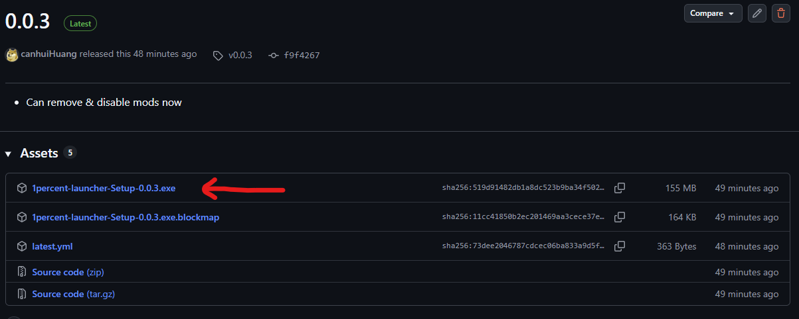
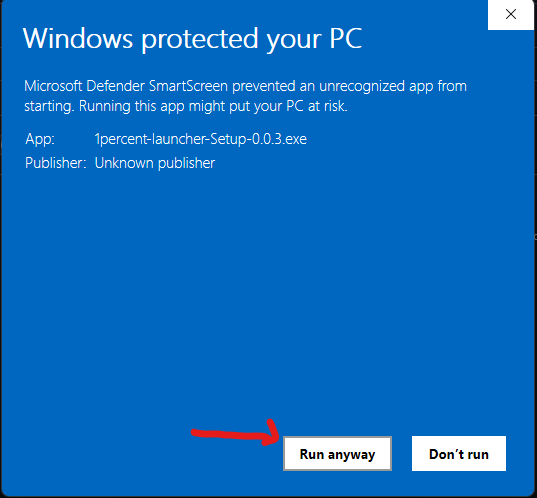
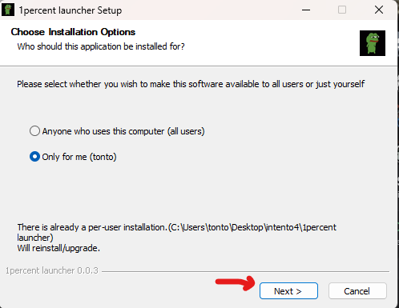
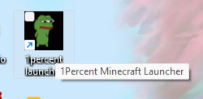
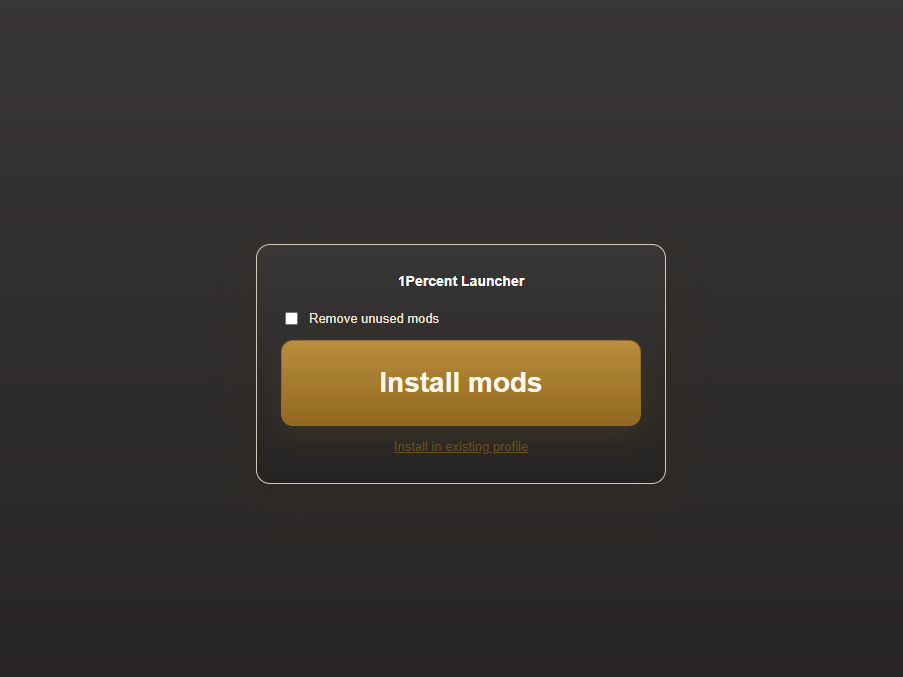
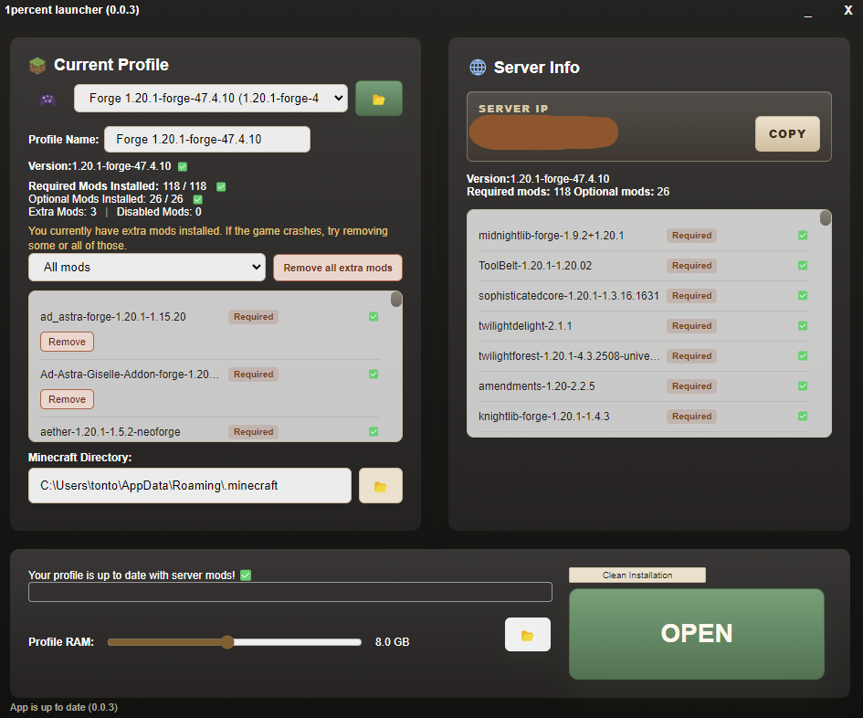
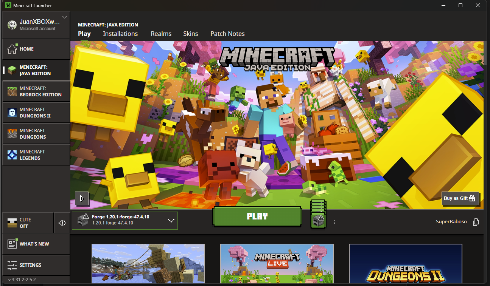
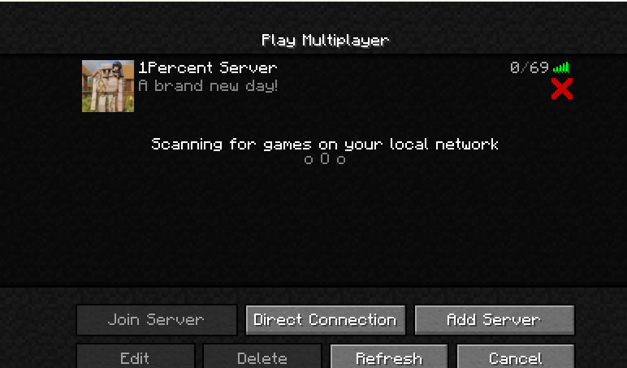
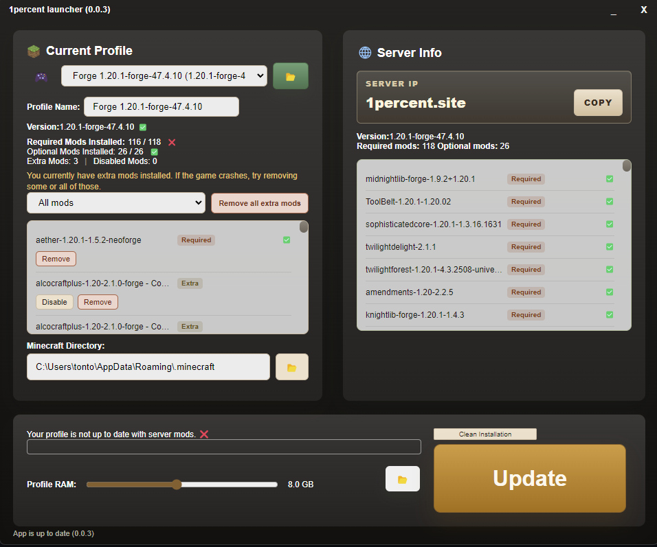

<h1 align="center">1Percent Launcher</h1>

### This program installs and maintains the required Forge version and mods for the 1Percent Minecraft server.

No more manual downloads or file moving.

## Setup & Usage

## 0) Install [Minecraft](https://www.minecraft.net/en-us/download) if you haven’t already.

## 1) Download the Installer [here](https://github.com/canhuiHuang/1percentlauncher/releases)



Download the latest installer from the Releases page

## 2) Install the Program




Run the installer and follow the setup steps.

## 3) Open the Launcher



Open 1percent launcher.exe.

## 4) Install Mods



### Clean Installation (1st opening Minecraft in years)

Click Install Mods. The launcher will automatically install the correct Forge version and required mods.

### If you already have a minecraft profile

Press <u>Install in existing profile</u>, I recommend this option if you know what you're doing.

## 5) Open Minecraft Launcher



Once installation is complete, click Open to launch the Minecraft Launcher.

## 6) Play



Click Play.
The correct profile should already be selected.

## 7) Join the Server



Go to Multiplayer and join the server.

<br>
<br>

# Keep your minecraft profile update for the server

You can use launcher to keep your mods up to date.
If the server updates, just press Update again.


## If you don't want to use the release .exe, you can also run this program by

1 - Install [Node.js](https://nodejs.org/en/download/current)

2 - Clone repo, install dependencies, run program.

```bash
git clone https://github.com/canhuiHuang/1percentlauncher.git
npm install
npm run dev
```
