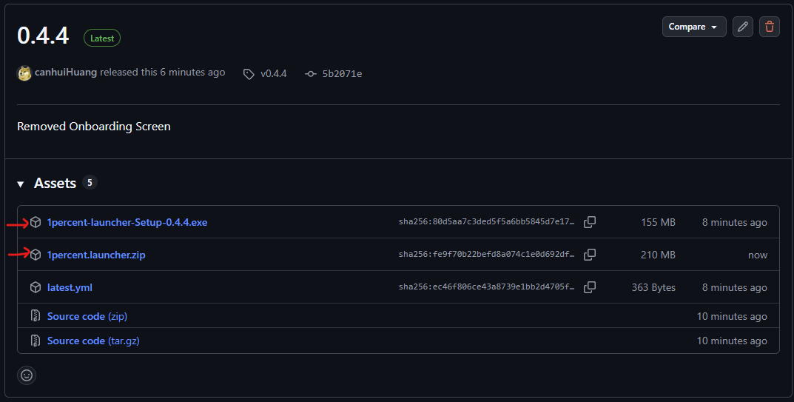
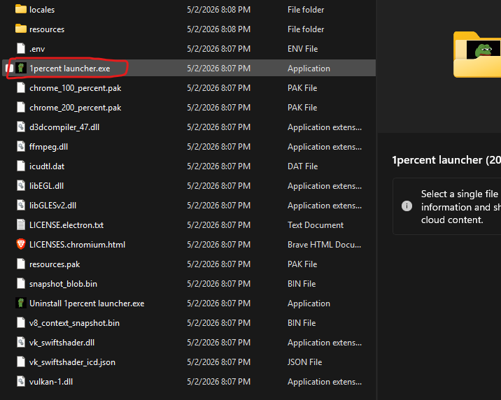
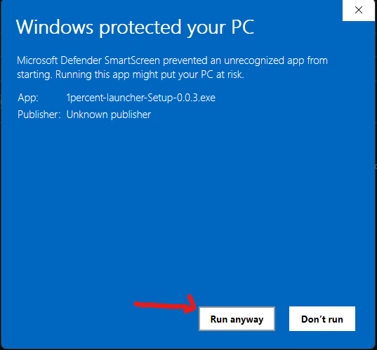
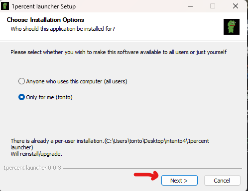
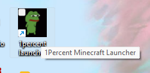
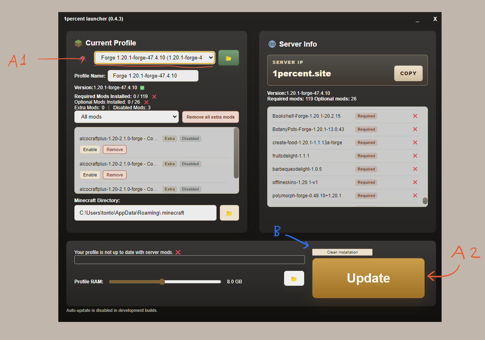
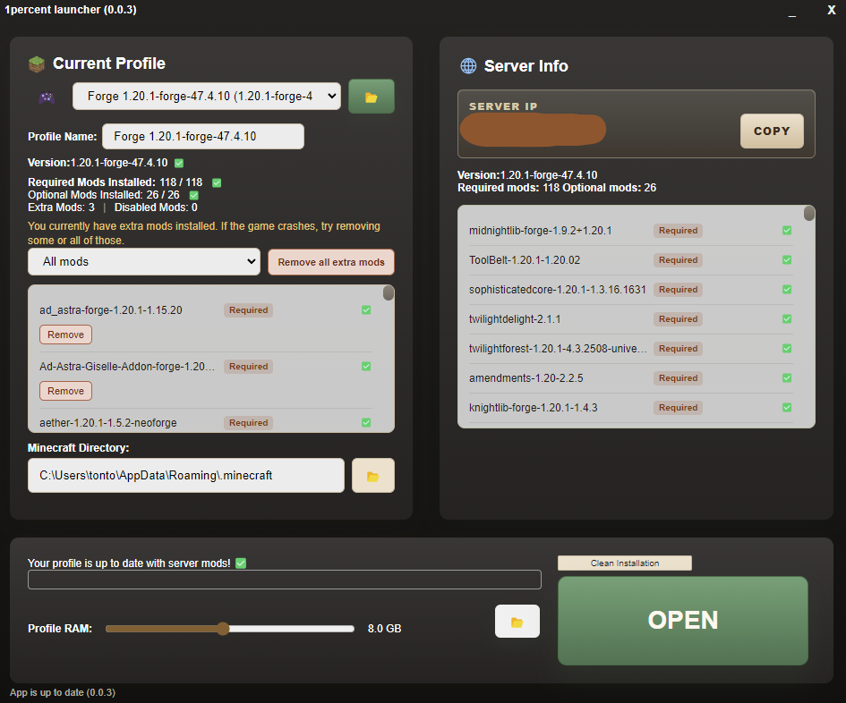
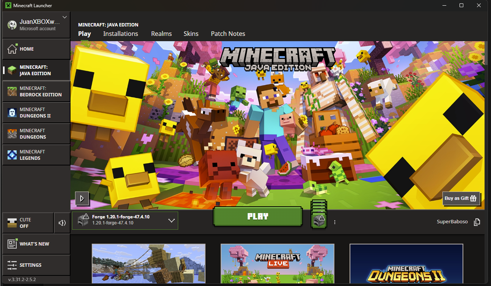
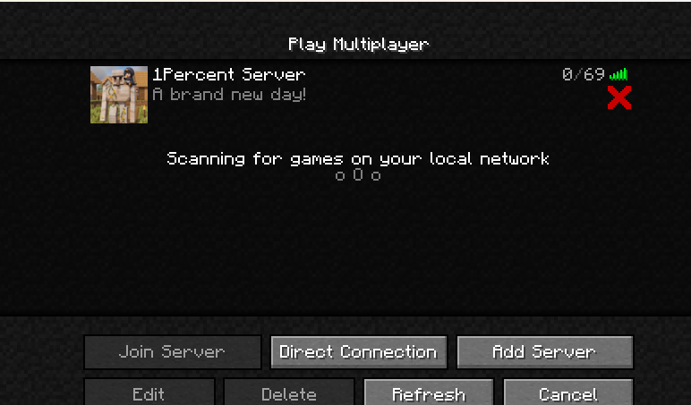
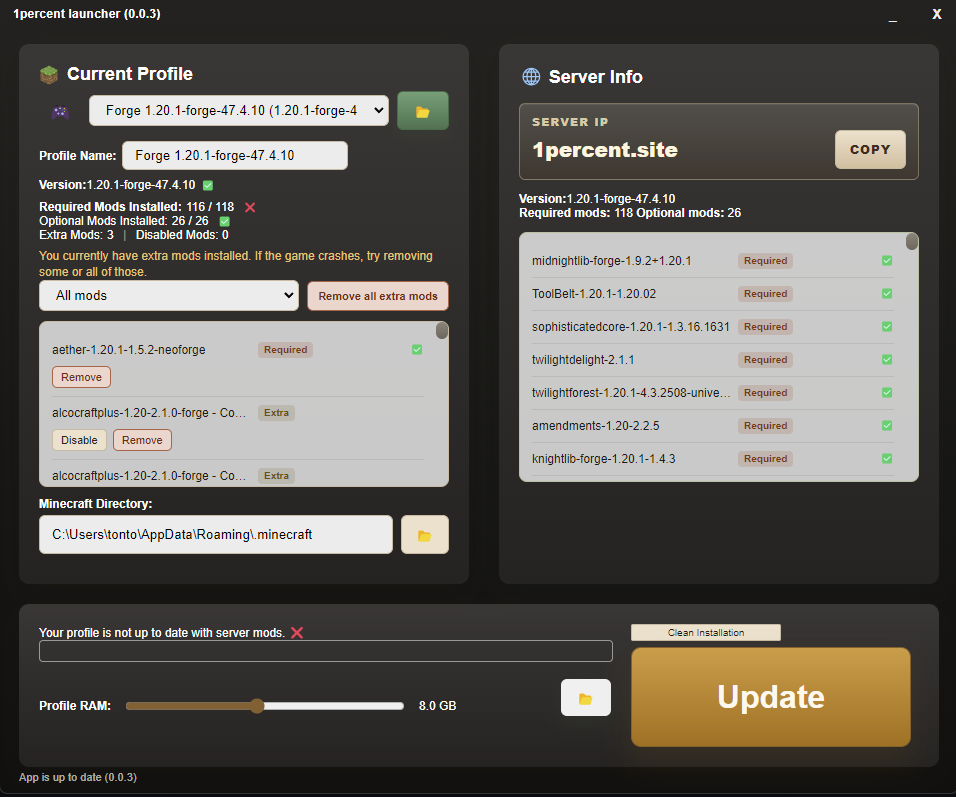

<h1 align="center">1Percent Launcher</h1>

### This program installs and maintains the required Forge version and mods for the 1Percent Minecraft server.

No more manual downloads or file moving.

## Setup & Usage

## 0) Install [Minecraft](https://www.minecraft.net/en-us/download) if you haven’t already.

## 1) Download the Installer or portable .zip [here](https://github.com/canhuiHuang/1percentlauncher/releases)



Download the latest installer or portable .zip from the Releases page

## 2) Install the Program

### Portable .zip

If you downloaded the portable .zip, just unzip and execute 1percentlauncher.exe



### Installer

If you downloaded the installer, run the installer and follow the setup steps.





Open 1percent launcher.exe

### From source code

If you want, you can clone this repo and run the program yourself.
[See more](#open-source-how-to-run-the-project)

## 3) Install Mods



### Option A (Existing Profile)

If you already have a Minecraft Profile, select that profile to install forge & mods for that profile.

- A1: Select your existing minecraft profile
- A2: Click on Update button

### Option B (New Profile)

Do a clean installation in a new profile

- B: Click on Clean Installation button

## 4) Ready



Once installation is complete, you can click on the Open button to launch the official Minecraft Launcher with the corresponding profile.

## 5) Play



Click Play.
The correct profile should already be selected.

## 6) Join the Server



Go to Multiplayer and join the server.

<br>
<br>

# Keep your minecraft profile update for the server

You can use launcher to keep your mods up to date.
If the server updates, just press Update again.



## Open source. How to run the project

1 - Install [Node.js](https://nodejs.org/en/download/current)

2 - Clone repo

```bash
git clone https://github.com/canhuiHuang/1percentlauncher.git
```

3 - Ask me for the .env file :p

4 - install dependencies, run program.

```bash
git fetch
git pull
npm install
npm run dev
```
